# Name

Irfan Nadiadi

# How many points have you earned?

44/100

(Make your own calculation and replace the number 0 with the points you think you've earned.)

# How many hours have you spent on this?

fill-in-your-answer

# When did you first start working on this week's learning challenges?

fill-in-your-answer

# What is the most difficult part about this week's challenge?

fill-in-your-answer

# Show and tell (6 points)

## Link (2 points)

[title-of-the-article](http://link-to-an-interesting-D3-visualization-example)

## Write down TWO D3 features you’d like to learn next . (4 points)

fill-in-your-answer

# MongoDB III

## Checkpoints (4 points x 1 = 4 points)

# 1. (4 points)

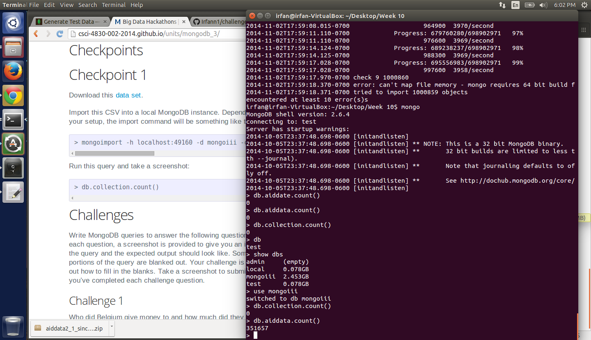

## Challenges (5 points x 5 = 25 points)

# 1. (5 points)

> db.aiddata.find({ 'donor':'Belgium', 'disbursement_amount':{ $gt:0 }}, { '_id':0, 'recipient':1, 'disbursement_amount':1 });

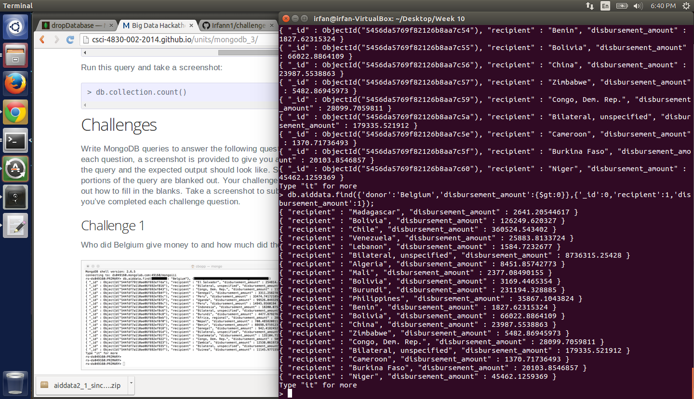

# 2. (5 points)

> db.aiddata.find({ 'biodiversity':{ $ne:'' }, 'disbursement_amount':{ $gt: 0 }}, { '_id':0, 'disbursement_amount':1, 'title':1})

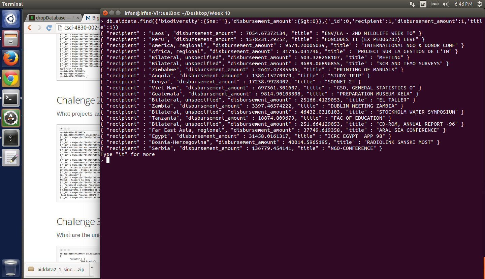

# 3. (5 points)

> db.runCommand({ distinct: 'aiddata', key: 'flow_type' });

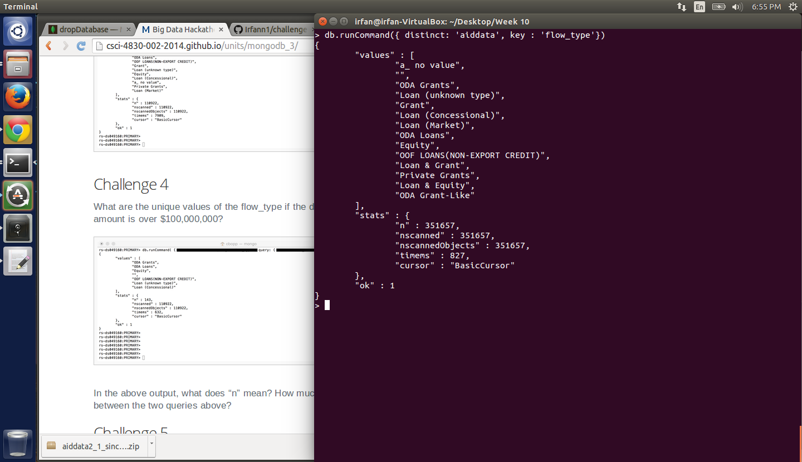

# 4. (5 points)

'n' is the count of the results from the query. The second result is magnitudes smaller than the first because the results are limited by the filter for disbursement amount greater than 100,000,000

>  db.runCommand({ distinct: 'aiddata', key: 'flow_type', query: { 'disbursement_amount': {$gt:100000000}}});

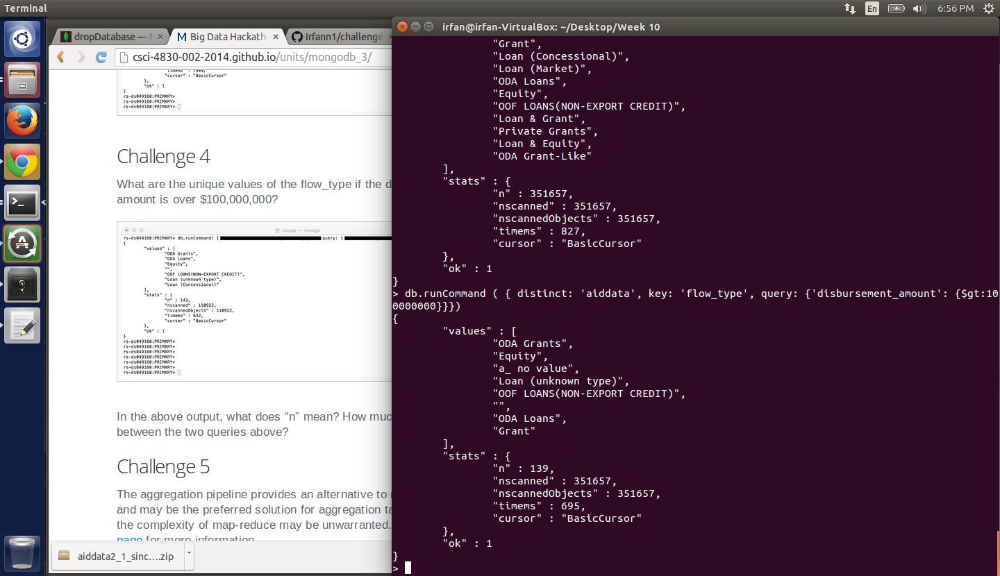

# 5. (5 points)

> db.aiddata.aggregate([ { $match: { 'donor':'Belgium' }}
						 { $group: { '_id':'$year', 'total':{ $sum: '$disbursement_amount' }}}
						 ]);

# Machine Learning (II)

## Challenge 1 (3 points x 4 = 12 points)

### a. (3 points)

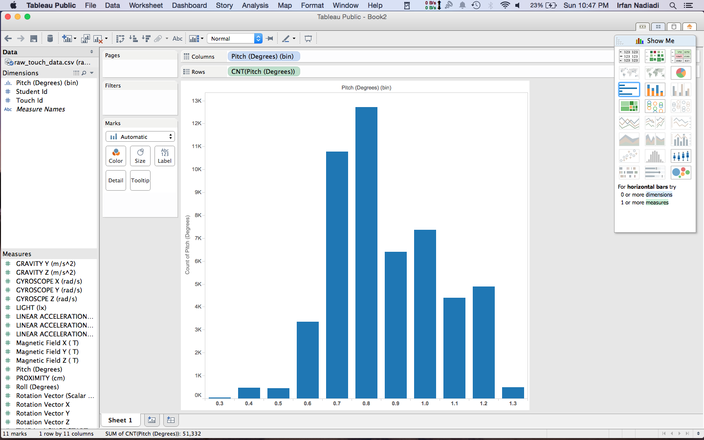

### b. (3 points)

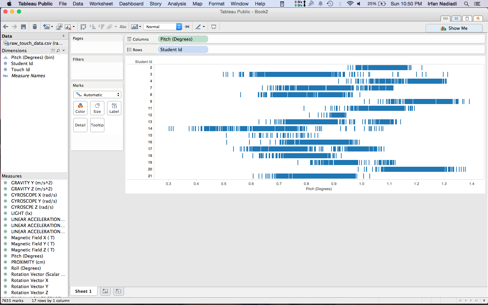

### c. (3 points) 

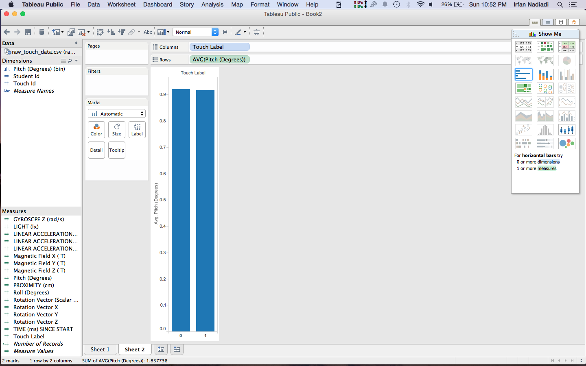

### d. (3 points) 

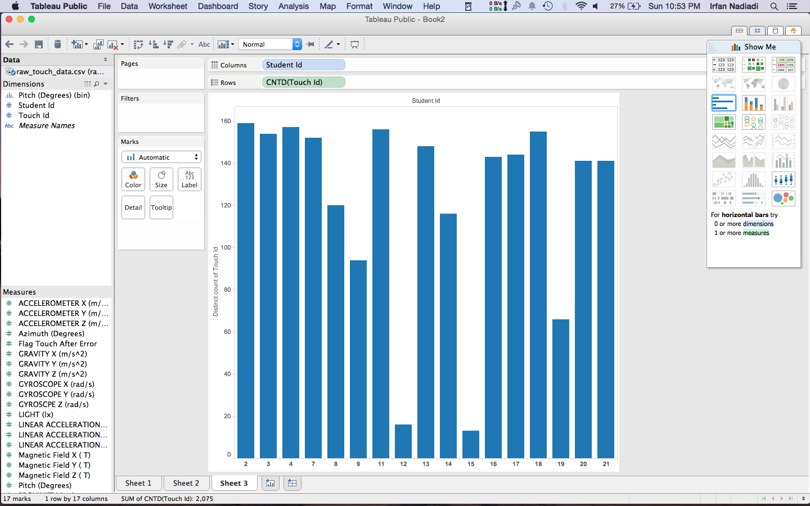

## Challenge 2 (8 points)

{text-and-images}

# D3 (V)

## Checkpoints (5 points x 4 = 20 points)

# 1. (5 points)

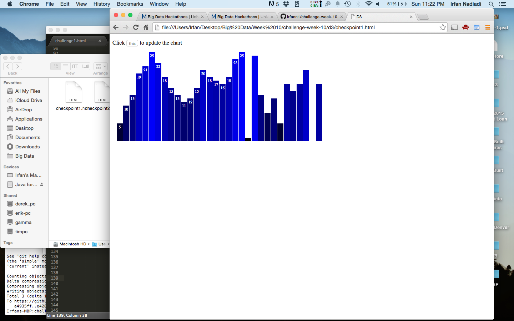

[checkpoint](d3/checkpoint1.html)

# 2. (5 points)

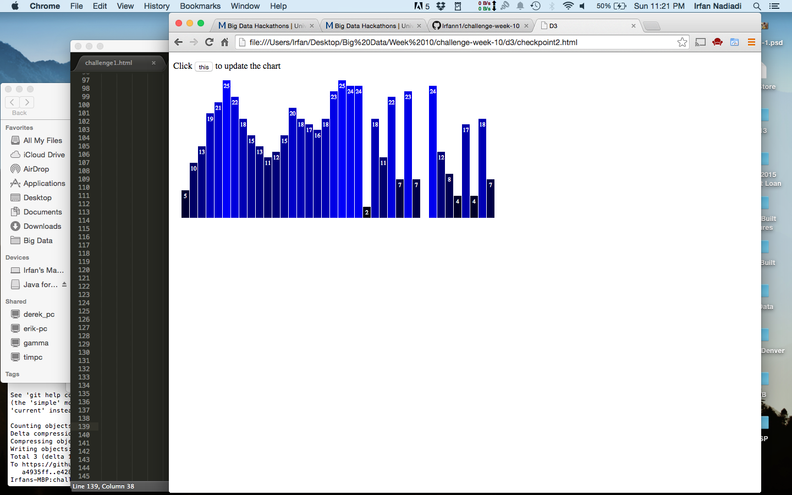

[checkpoint](d3/checkpoint2.html)

# 3. (5 points)

[checkpoint](checkpoint.html)

# 4. (5 points)

[checkpoint](checkpoint.html)

## Challenges 	(5 points x 3 + 10 points = 25 points)

### 1. (5 points)

### 2. (5 points)

### 3. (5 points)

### 4. (10 points)

