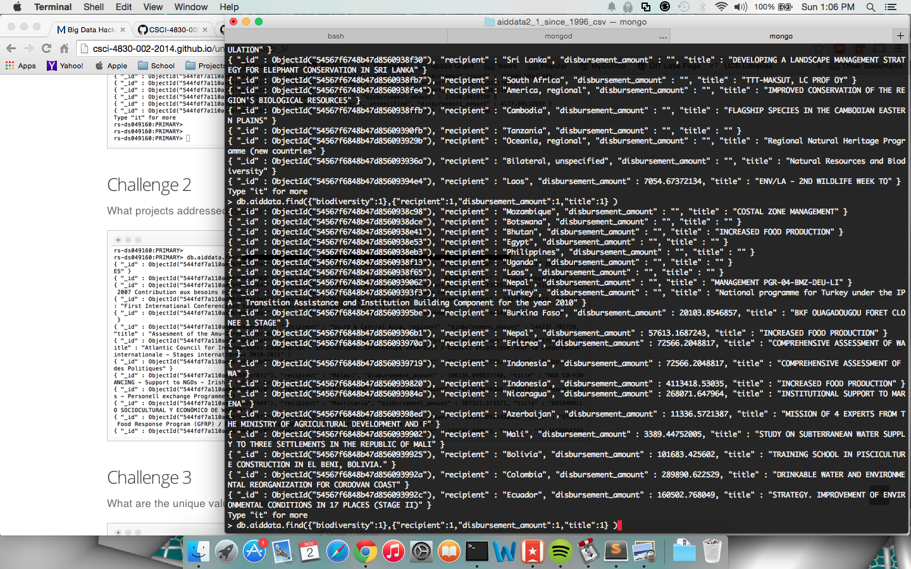
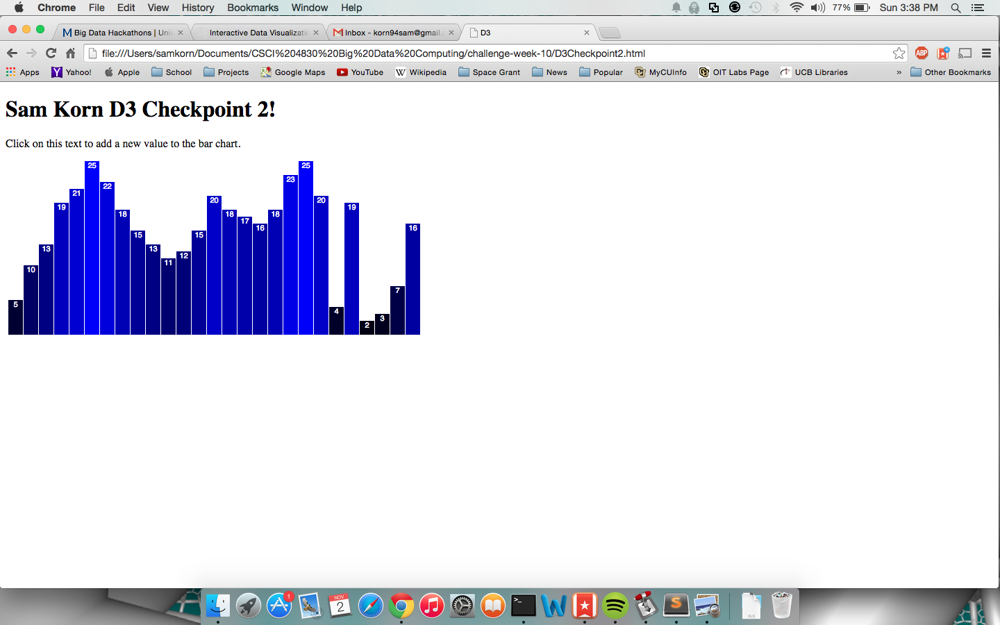
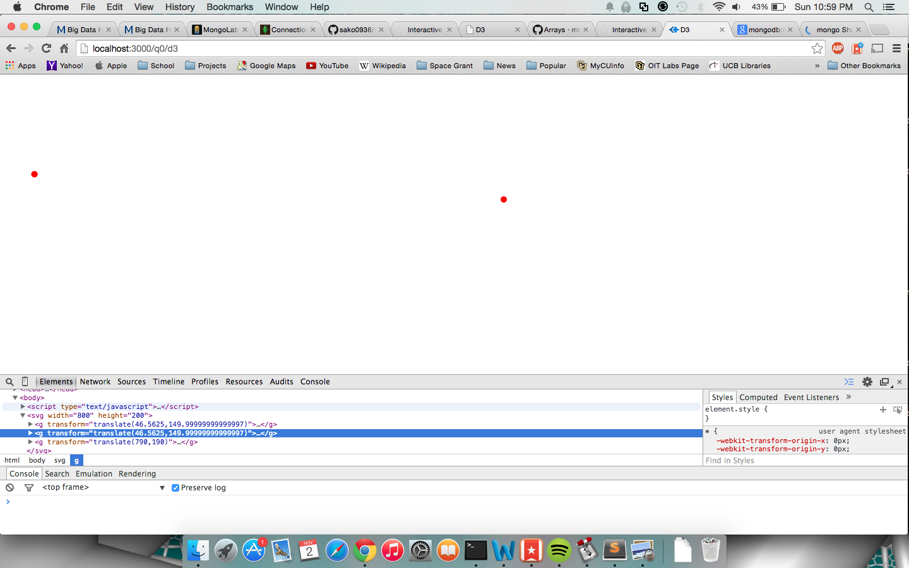
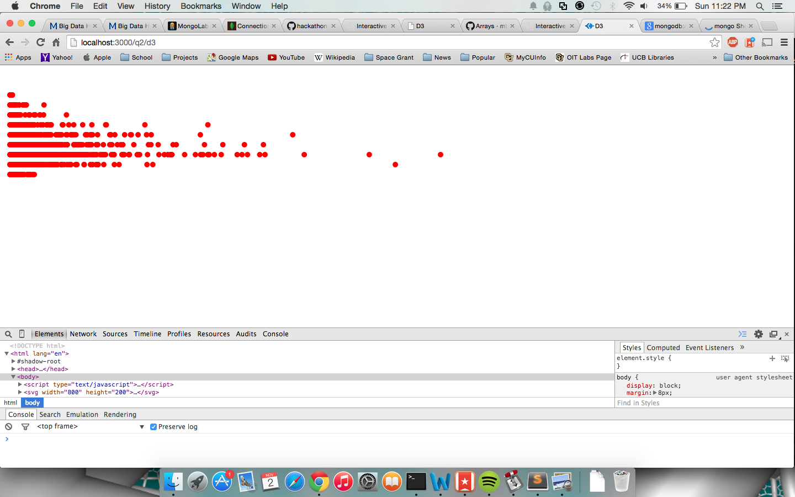

# Name

Sam Korn

# How many points have you earned?

90/100

(Make your own calculation and replace the number 0 with the points you think you've earned.)

# How many hours have you spent on this?

8 Hours

# When did you first start working on this week's learning challenges?

Sunday 10:30AM

# What is the most difficult part about this week's challenge?

D3 took the longest amount of time. Getting last weeks hackathon took a while to get going because of user permissions with MongoLab.

# Show and tell (6 points)

## Link (2 points)

[Uber Rides by Neighborhood](http://bost.ocks.org/mike/uberdata/)

## Write down TWO D3 features you’d like to learn next . (4 points)

Sunburst effect
Greater depth in making SVG animations, with buttons to make change. Games?

# MongoDB III

## Checkpoints (4 points x 1 = 4 points)

# 1. (4 points)

## Challenges (5 points x 5 = 25 points)

# 1. (5 points)

> db.aiddata.find({"donor":"Belgium"},{"recipient":1,"disbursement_amount":1} )

# 2. (5 points)

> db.aiddata.find({"biodiversity":1},{"recipient":1,"disbursement_amount":1,"title":1} )

# 3. (5 points)

> db.runCommand({distinct:"aiddata",key:"flow_type"})

# 4. (5 points)

> db.runCommand({distinct:"aiddata",key:"flow_type",query:{"disbursement_amount":{$gt :100000000}} })

The n value in the stats field represents the number of entries that match the query. Since challenge 3 had no query, it searched for unique values among all entries, but in challenge 4 only 994 values had a disbursement amount greater than $100,000,000.

# 5. (5 points)

> db.aiddata.aggregate([{ $match:{"donor":"Belgium"} },{$group:{"_id":"$year",total:{$sum:"$disbursement_amount"} } }])

# Machine Learning (II)

## Challenge 1 (3 points x 4 = 12 points)

### a. (3 points)

### b. (3 points)

### c. (3 points) 

### d. (3 points) 

## Challenge 2 (8 points)
In this visualization I compared the amount of touch events to the amount of time the user spent using the app. My findings seem to make sense because the longer the user stayed in the app, the more touches they did. My metric might be slightly flawed however since I used a SUM of the "Touch Label" field, which in effect only counts the number of presses to the right. There are a couple of users that have a fairly low count of right touch events, and when the time field adjusting the color is added, it can be seen that the descrepency is likely because they stopped early, rather than just favoring a left press over a right press.

# D3 (V)

## Checkpoints (5 points x 4 = 20 points)

# 1. (5 points)

[checkpoint](D3Checkpoint1.html)

# 2. (5 points)

[checkpoint](D3Checkpoint2.html)

# 3. (5 points)

[checkpoint](D3Checkpoint3.html)

# 4. (5 points)

[checkpoint](D3Checkpoint4.html)

## Challenges 	(5 points x 3 + 10 points = 25 points)

### 1. (5 points)

### 2. (5 points)

### 3. (5 points)

### 4. (10 points)

