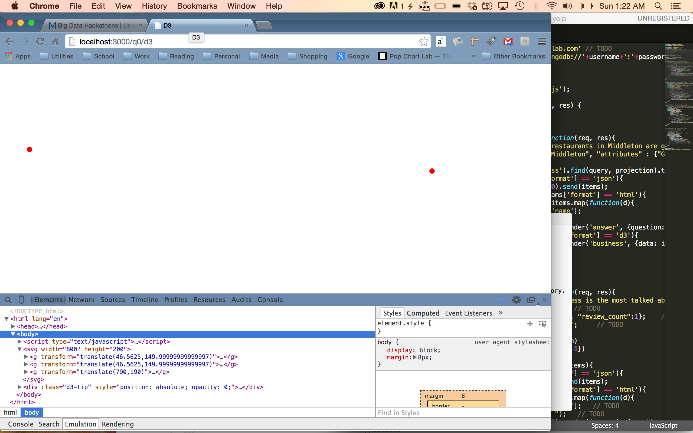
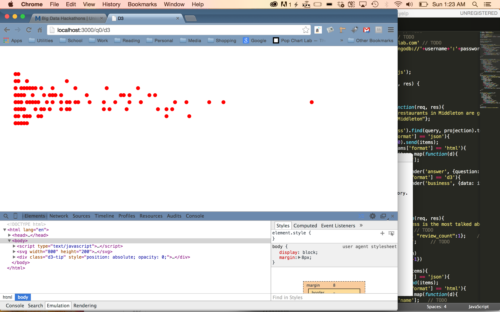

# Name

Michael Fyk

# How many points have you earned?

92/100

(Make your own calculation and replace the number 0 with the points you think you've earned.)

# How many hours have you spent on this?

5

# When did you first start working on this week's learning challenges?

Thursday

# What is the most difficult part about this week's challenge?

D3 Checkpoints

# Show and tell (6 points)

## Link (2 points)

[Using D3 to Visualize GIS](http://www.smartjava.org/content/using-d3js-visualize-gis)

## Write down TWO D3 features you’d like to learn next . (4 points)

Mapping with D3
Extensions/libraries for D3

# MongoDB III

## Checkpoints (4 points x 1 = 4 points)

# 1. (4 points)

## Challenges (5 points x 5 = 25 points)

# 1. (5 points)

> db.aid.find({'donor': 'Belgium', 'disbursement_amount': {$gt:0}}, {"recipient":1, "disbursement_amount":1})

# 2. (5 points)

> db.aid.find({'biodiversity': {$ne:""}, 'disbursement_amount': {$gt:0}}, {"recipient":1, "disbursement_amount":1, "title":1, "biodiversity":1})

# 3. (5 points)

> db.runCommand ( { distinct: "aid", key: "flow_type" } )

# 4. (5 points)

> db.runCommand ( { distinct: "aid", key: "flow_type", query: {'disbursement_amount': {$gt:100000000}}})

Respons: n refers to the number of records in a collection that match the query. The second query has a much lower n than the first because it is only counting records with a disbursement amount greater than $100,000,000

# 5. (5 points)

> db.aid.aggregate( [ { $match: {"donor":"Belgium"}} , {$group:{_id:"$year",total:{$sum:"$disbursement_amount"}}}])

# Machine Learning (II)

## Challenge 1 (3 points x 4 = 12 points)

### a. (3 points)

### b. (3 points)

### c. (3 points) 

### d. (3 points) 

## Challenge 2 (8 points)

{text-and-images}

# D3 (V)

## Checkpoints (5 points x 4 = 20 points)

# 1. (5 points)

[checkpoint](Ch1D3.html)

# 2. (5 points)

[checkpoint](Ch2D3.html)

# 3. (5 points)

[checkpoint](Ch3D3.html)

# 4. (5 points)

[checkpoint](Ch4D3.html)

## Challenges 	(5 points x 3 + 10 points = 25 points)

### 1. (5 points)

### 2. (5 points)

### 3. (5 points)

### 4. (10 points)

Fans/Friends on are on the x and y axis respectively

