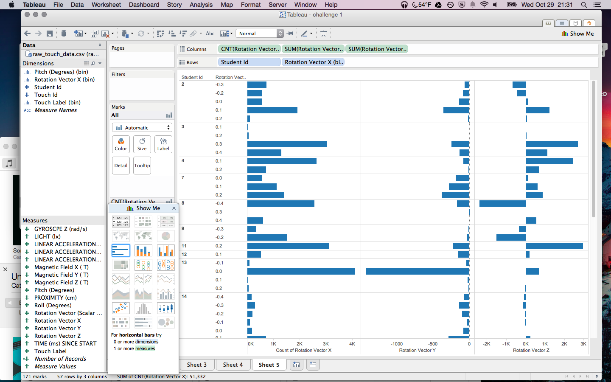
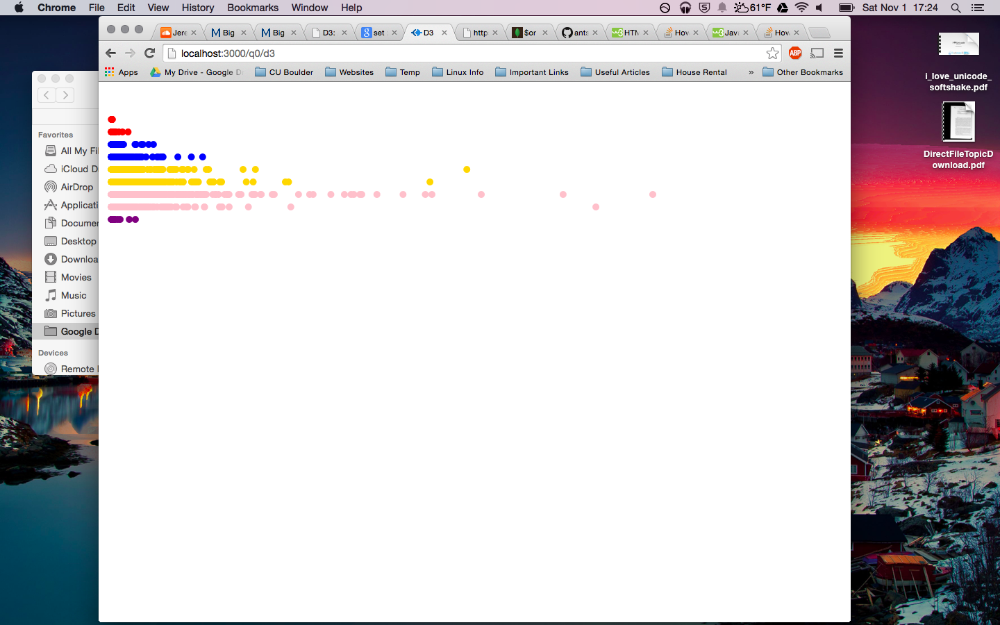

# Name

Alexander Tsankov

# How many points have you earned?

0/100

(Make your own calculation and replace the number 0 with the points you think you've earned.)

# How many hours have you spent on this?

fill-in-your-answer

# When did you first start working on this week's learning challenges?

10/29/14

# What is the most difficult part about this week's challenge?

fill-in-your-answer

# Show and tell (6 points)

## Link (2 points)

[Trade Deficit Graph](http://www.brightpointinc.com/interactive/ustrade/index.html?source=d3js)

## Write down TWO D3 features you’d like to learn next . (4 points)

Two features I would like to learn are: 
	- Learning more about prebuilt graphing libraries. 
	- Different types of charts besides line or scatter. 

# MongoDB III

## Checkpoints (4 points x 1 = 4 points)

# 1. (4 points)

## Challenges (5 points x 5 = 25 points)

# 1. (5 points)

> db.aiddata.find({'donor' : 'Belgium' , 'disbursement_amount': {$ne: ''}},{"disbursement_amount":-1, "recipient":-1})

# 2. (5 points)

> db.aiddata.find({'biodiversity' : {$in : [1,2] }},{"disbursement_amount":-1, "recipient":-1, "title":-1})

# 3. (5 points)

> db.runCommand({distinct: 'aiddata', key: 'flow_type'})

# 4. (5 points)

> db.runCommand({distinct: 'aiddata', key: 'flow_type',query: {"disbursement_amount" : {$gt : 100000000}, "commitment_amount_currency" : "USD" }})

# 5. (5 points)

> db.aiddata.aggregate( [ {$match: { 'donor' : 'Belgium'} },{$group: {_id : "$year",total: { $sum : "$disbursement_amount" } } } ] )

# Machine Learning (II)

## Challenge 1 (3 points x 4 = 12 points)

### a. (3 points)

### b. (3 points)

### c. (3 points) 

### d. (3 points) 

## Challenge 2 (8 points)

One way to use Tableau would be to quickly identify who hasn't followed instructions. The instructions said that we needed to hold the phone, so we should see some variance between the x,y,z axis. In the chart, we can see that student 13 does not have this variance and we can safely assume that they placed their phone on the table for the duration of the experiment. We can also glean information about the most comfortable ergonomic position for subjects to hold the phone as well. 

# D3 (V)

## Checkpoints (5 points x 4 = 20 points)

# 1. (5 points)

[checkpoint](checkpoint-1.html)

# 2. (5 points)

[checkpoint](checkpoint.html)

# 3. (5 points)

[checkpoint](checkpoint.html)

# 4. (5 points)

[checkpoint](checkpoint.html)

## Challenges 	(5 points x 3 + 10 points = 25 points)

### 1. (5 points)

### 2. (5 points)

### 3. (5 points)

### 4. (10 points)

For this challenge, I changed the color of the dots to represent the rating in stars of the resteraunt. It if it's one star it is red, 2 stars for blue, 3 for gold, 4 for pink, and 5 for purple. 

